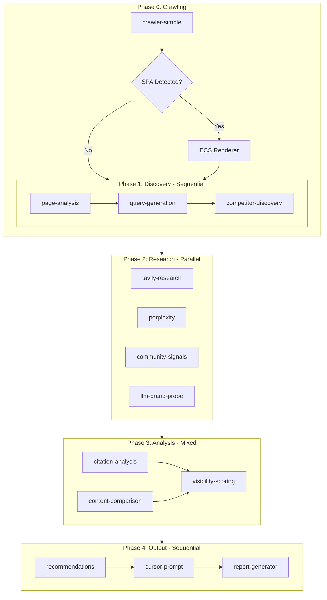

# AI Agent Architecture

This document details the multi-agent system powering BrandSight's AEO (Answer Engine Optimization) analysis.

## Overview

When a job is created via `POST /jobs` with a `targetUrl`, the system:
1. **Crawls** the site (up to 50 pages, 3 levels deep) using HTTP fetch
2. **Detects SPAs** and optionally renders with ECS/Puppeteer
3. **Analyzes** pages through a pipeline of 12 specialized agents
4. **Generates** a comprehensive AEO report with actionable recommendations



## Phase 0: Crawling

HTTP-based crawl using Cheerio, starting from `targetUrl`:
- **Max Pages**: 50 (configurable, max 100)
- **Max Depth**: 3 levels
- **Respects**: robots.txt, URL exclusions
- **SPA Detection**: Automatically detects SPAs and uses ECS/Puppeteer when needed

## Phase 1: Discovery (Sequential)

| Agent | Purpose | Inputs | Outputs |
|-------|---------|--------|---------|
| `page-analysis` | Extracts topic, user intent, content type, and 10-20 key entities | Crawled pages | `PageAnalysis` |
| `query-generation` | Generates 10-15 target queries the page should rank for | `PageAnalysis` | `TargetQuery[]` |
| `competitor-discovery` | Identifies competing domains from search results | `TargetQuery[]` | `CompetitorVisibility[]` |

## Phase 2: Research (Parallel)

| Agent | Purpose | Inputs | Outputs |
|-------|---------|--------|---------|
| `tavily-research` | Performs live web searches for each target query | `TargetQuery[]` | `TavilySearchResult[]` |
| `perplexity` | Queries Perplexity for AI-generated citations | `TargetQuery[]` | `PerplexityResult[]` |
| `community-signals` | Finds engagement opportunities on Reddit and X/Twitter | `TargetQuery[]` | `CommunitySignal[]` |
| `llm-brand-probe` | Probes LLMs directly to measure brand visibility in AI responses (GEO) | `PageAnalysis`, `TargetQuery[]`, `CompetitorVisibility[]` | `GeoBrandProbeResult` |

**Note**: The `llm-brand-probe` agent implements GEO (Generative Engine Optimization) by:
1. Generating contextually relevant prompts based on brand analysis
2. Probing LLMs (GPT-4) with those prompts
3. Analyzing responses for brand mentions, sentiment, and competitor presence

## Phase 3: Analysis (Mixed Execution)

| Agent | Purpose | Inputs | Execution |
|-------|---------|--------|-----------|
| `citation-analysis` | Analyzes citation patterns, frequency, and position | `TavilySearchResult[]` | Parallel |
| `content-comparison` | Compares content against competitors | `PageAnalysis`, `CompetitorVisibility[]`, `TavilySearchResult[]` | Parallel |
| `visibility-scoring` | Calculates AEO visibility score (0-100) | `CitationAnalysisResult`, `ContentComparisonResult` | After above complete |

### Visibility Score Calculation

**Without GEO data (Legacy Mode):**

| Component | Weight | Description |
|-----------|--------|-------------|
| Citation Rate | 35% | How often you appear in AI search results |
| Rank Quality | 25% | Position when you do appear (top 3 = bonus) |
| Competitive Position | 20% | How you compare to top competitors |
| Query Breadth | 10% | Coverage across different query types |
| Gap Penalty | -10% | Penalty for missed opportunities |

**With GEO data (Enhanced Mode):**

| Component | Weight | Description |
|-----------|--------|-------------|
| Citation Rate | 28% | How often you appear in AI search results |
| Rank Quality | 20% | Position when you do appear |
| Competitive Position | 15% | How you compare to top competitors |
| Query Breadth | 8% | Coverage across different query types |
| Gap Penalty | -9% | Penalty for missed opportunities |
| GEO Score | 20% | LLM brand recognition score |

**Grade Scale:**
- A+ (90+), A (85+), A- (80+)
- B+ (75+), B (70+), B- (65+)
- C+ (60+), C (55+), C- (50+)
- D (40+), F (<40)

## Phase 4: Output (Sequential)

| Agent | Purpose | Inputs | Outputs |
|-------|---------|--------|---------|
| `recommendations` | Generates 5-8 prioritized actions (High/Medium/Low impact) | `VisibilityScore`, `ContentComparisonResult` | `AEORecommendation[]` |
| `cursor-prompt` | Creates copy-paste prompt for AI-assisted content fixes | `AEORecommendation[]` | `CursorPrompt` |
| `report-generator` | Compiles final AEO report (JSON + Markdown) | All results | `AEOReport` |

## Orchestration

The `OrchestratorAgent` coordinates execution:

1. **Plan Generation**: Creates an execution plan with dependency rules using LLM
2. **Context Management**: Stores agent results and manages context size
3. **Parallel Execution**: Runs agents in parallel where possible
4. **Reasoning Steps**: Evaluates results after each phase
5. **Progress Callbacks**: Notifies UI of phase completion for real-time updates
6. **Context Compression**: Compresses context when approaching token limits

### Error Handling

Each agent has an error handling strategy:
- `retry`: Retry on failure (most agents)
- `skip`: Skip and continue (optional agents like `perplexity`, `community-signals`)
- `fail`: Stop pipeline on failure

## Key Files

| Component | Path |
|-----------|------|
| Job handler | `apps/api/src/handlers/job.ts` |
| Orchestrator handler | `apps/api/src/handlers/orchestrator.ts` |
| Simple crawler | `apps/api/src/lib/crawler-simple.ts` |
| SPA detector | `apps/api/src/lib/spa-detector.ts` |
| ECS renderer | `apps/api/src/lib/renderer.ts` |
| Orchestrator agent | `apps/api/src/agents/orchestrator/orchestrator-agent.ts` |
| Plan generator | `apps/api/src/agents/orchestrator/plan-generator.ts` |
| Result reasoner | `apps/api/src/agents/orchestrator/result-reasoner.ts` |
| Agent registry | `apps/api/src/agents/registry.ts` |
| Agent executor | `apps/api/src/agents/executor.ts` |
| Context manager | `apps/api/src/agents/context/context-manager.ts` |

## Agent Registry

All agents are registered in `apps/api/src/agents/registry.ts` with metadata:

```typescript
interface AgentMetadata {
  id: string;
  name: string;
  description: string;
  category: 'discovery' | 'research' | 'analysis' | 'output';
  inputs: string[];       // Required input agent IDs
  outputs: string;        // Output type
  canRunInParallel: boolean;
  estimatedDuration: number; // seconds
  retryable: boolean;
  errorHandling: 'fail' | 'skip' | 'retry';
}
```
