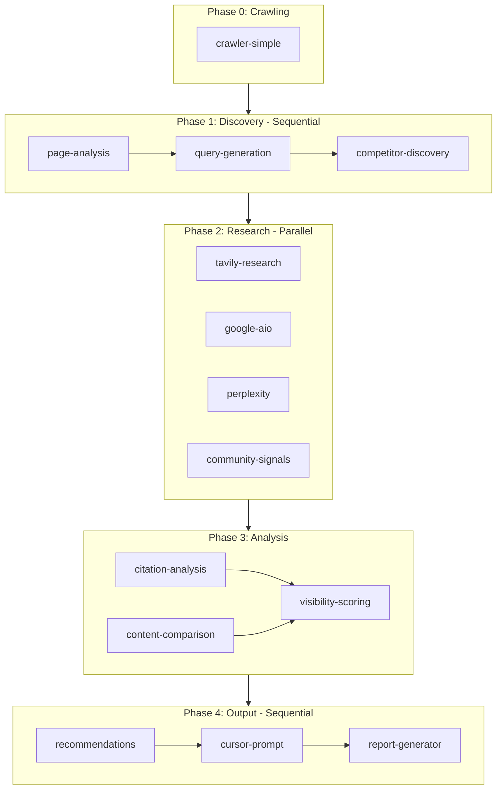

# AI Agent Architecture

This document details the multi-agent system powering PropIntel's AEO (Answer Engine Optimization) analysis.

## Overview

When a job is created via `POST /jobs` with a `targetUrl`, the system:
1. **Crawls** the site (up to 50 pages, 3 levels deep) starting from the target URL
2. **Analyzes** each page through a pipeline of 12 specialized agents
3. **Generates** a comprehensive AEO report with actionable recommendations

## Phase 0: Crawling

Breadth-first crawl starting from `targetUrl`. Discovers internal links and crawls up to 50 pages (configurable, max 100) at depth 3. Respects robots.txt and URL exclusions.

## Phase 1: Discovery (Sequential)

| Agent | Purpose |
|-------|---------|
| `page-analysis` | Extracts topic, user intent, content type, and 10-20 key entities |
| `query-generation` | Generates 10-15 target queries the page should rank for |
| `competitor-discovery` | Identifies competing domains from search results |

## Phase 2: Research (Parallel)

| Agent | Purpose |
|-------|---------|
| `tavily-research` | Performs live web searches for each target query |
| `llm-brand-probe` | Probes generic LLMs (GPT-4) for direct brand knowledge |
| `perplexity-agent` | Queries Perplexity for AI-generated citations |
| `community-agent` | Scans Reddit, HackerNews, GitHub for brand mentions |

## Phase 3: Analysis

| Agent | Purpose | Execution |
|-------|---------|-----------|
| `citation-analysis` | Analyzes citation patterns and frequency | Parallel |
| `content-comparison` | Compares content against competitors | Parallel |
| `visibility-scoring` | Calculates AEO visibility score (0-100) | After above complete |

**Visibility Score** = Citation Rate (35%) + Rank Quality (25%) + Competitive Position (20%) + Query Breadth (10%) + other factors (10%)

## Phase 4: Output (Sequential)

| Agent | Purpose |
|-------|---------|
| `recommendation` | Generates 5-8 prioritized actions (High/Medium/Low impact) |
| `cursor-prompt` | Creates copy-paste prompt for AI-assisted content fixes |
| `report-generator` | Compiles final AEO report |

## Orchestration

The `OrchestratorAgent` coordinates execution:
- Generates an execution plan with dependency rules
- Runs agents in parallel where possible
- Evaluates results after each phase ("reasoning" step)
- Can pivot based on results (e.g., stop if page is 404)
- Manages context compression to stay within token limits

## Key Files

| Component | Path |
|-----------|------|
| Job handler | `apps/api/src/handlers/job.ts` |
| Orchestrator handler | `apps/api/src/handlers/orchestrator.ts` |
| Crawler | `apps/api/src/lib/crawler-simple.ts` |
| Orchestrator agent | `apps/api/src/agents/orchestrator/orchestrator-agent.ts` |
| Agent registry | `apps/api/src/agents/registry.ts` |
