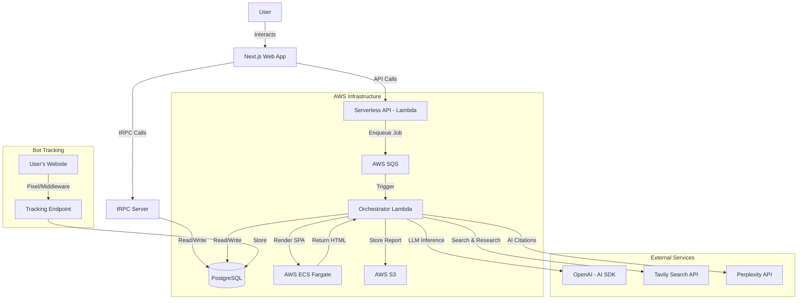

# Architecture Documentation

## Overview

BrandSight is a monorepo application designed to:
1. Track AI bot traffic to websites (GPTBot, ClaudeBot, etc.)
2. Perform Answer Engine Optimization (AEO) analysis using AI agents
3. Provide actionable recommendations for improving AI visibility

The system consists of a Next.js frontend, a Serverless AWS Lambda backend API, and an asynchronous worker pipeline powered by SQS.

## High-Level Architecture



## Component Details

### 1. Frontend (`apps/web`)
- **Framework**: Next.js 14+ (App Router)
- **Styling**: Tailwind CSS with Shadcn UI components
- **State Management**: React Query (TanStack Query), Zustand
- **Communication**: tRPC for type-safe API calls
- **Authentication**: NextAuth.js
- **Key Features**:
  - Bot traffic analytics dashboard
  - AEO analysis pipeline visualization
  - Robots.txt/llms.txt analysis
  - Multi-site management with site context

**Key Routes**:
| Route | Description |
|-------|-------------|
| `/dashboard` | Bot traffic analytics and site overview |
| `/dashboard/agent-analysis` | AEO analysis jobs and results |
| `/dashboard/robots` | Robots.txt and llms.txt analysis |
| `/login` | Authentication page |

### 2. Backend API (`apps/api`)
- **Runtime**: Node.js on AWS Lambda
- **Framework**: Serverless Framework
- **Key Handlers**:
  - `job.ts`: Create and retrieve analysis jobs
  - `orchestrator.ts`: SQS-triggered worker for running analysis
  - `dashboard.ts`: Dashboard data endpoints
  - `health.ts`: Health check endpoints
  - `docs.ts`: OpenAPI documentation
  - `schedules.ts`: Scheduled tasks

**API Endpoints**:
| Method | Endpoint | Description |
|--------|----------|-------------|
| POST | `/jobs` | Create a new analysis job |
| GET | `/jobs/:id` | Get job status |
| GET | `/jobs/:id/report` | Retrieve the generated report (JSON or Markdown) |

### 3. Worker Pipeline (`apps/api/src/handlers/orchestrator.ts`)
The core logic resides in the Orchestrator Lambda, which is triggered by SQS messages.

**Pipeline Phases:**
1. **Crawling**: Fetches the target URL using HTTP (Cheerio) or ECS (Puppeteer for SPAs)
2. **LLMEO/SEO Analysis**: Traditional analysis (synchronous)
3. **AEO Pipeline**: Multi-agent orchestrated analysis
4. **Report Generation**: Compiles and uploads final report

### 4. AI Agent Architecture (`apps/api/src/agents`)
BrandSight uses a multi-agent system with 12 specialized agents organized into 4 phases.

| Phase | Agents | Execution |
|-------|--------|-----------|
| **Discovery** | `page-analysis`, `query-generation`, `competitor-discovery` | Sequential |
| **Research** | `tavily-research`, `perplexity`, `community-signals`, `llm-brand-probe` | Parallel |
| **Analysis** | `citation-analysis`, `content-comparison`, `visibility-scoring` | Mixed |
| **Output** | `recommendations`, `cursor-prompt`, `report-generator` | Sequential |

The `OrchestratorAgent` coordinates execution with:
- Dynamic execution plan generation
- Context management and compression
- Progress callbacks for real-time UI updates
- Reasoning after each phase

### 5. Database (`packages/database`)
- **System**: PostgreSQL (Neon serverless or standard)
- **ORM**: Drizzle ORM

**Schema Entities**:

| Table | Description |
|-------|-------------|
| `users` | User accounts (NextAuth) |
| `accounts` | OAuth account links |
| `sessions` | Active sessions |
| `sites` | Websites being tracked/analyzed |
| `jobs` | Analysis job records |
| `crawled_pages` | Pages crawled per job |
| `reports` | Report S3 references |
| `analyses` | Analysis summaries (fast queries) |

**Job Statuses**: `pending`, `queued`, `crawling`, `analyzing`, `completed`, `failed`, `blocked`

### 6. Storage (`AWS S3`)
Stores heavy JSON and Markdown reports to avoid bloating the database:
- `{userId}/{jobId}/reports/report.json` - Full JSON report
- `{userId}/{jobId}/reports/report.md` - Markdown report
- `{userId}/{jobId}/data/pages.json` - Crawled page data
- `{userId}/{jobId}/snapshots/` - HTML snapshots

## Key Technologies

| Category | Technology |
|----------|------------|
| Monorepo | Turborepo + PNPM |
| Frontend | Next.js 14+, React, Tailwind CSS, Shadcn UI |
| Backend | Node.js, Serverless Framework, AWS Lambda |
| Database | PostgreSQL, Drizzle ORM |
| Queue | AWS SQS |
| Storage | AWS S3 |
| AI | Vercel AI SDK, OpenAI, Tavily, Perplexity |
| Auth | NextAuth.js |
| API | tRPC (frontend), REST (external API) |
| Observability | Langfuse (LLM tracing) |

## Package Structure

```
propintel/
  apps/
    web/           # Next.js frontend
    api/           # Serverless backend
  packages/
    database/      # Drizzle ORM schema and client
    types/         # Shared TypeScript types
    eslint-config/ # Shared ESLint configuration
    typescript-config/ # Shared TS configs
```

## Deployment

- **Frontend**: Vercel or similar (Next.js hosting)
- **Backend**: AWS Lambda via Serverless Framework
- **Database**: Neon (serverless PostgreSQL) or AWS RDS
- **SPA Rendering**: AWS ECS Fargate (on-demand)
