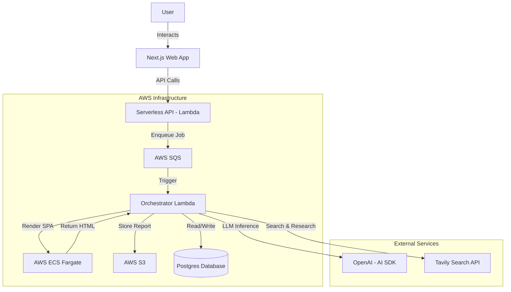

# Architecture Documentation

## Overview

PropIntel is a monorepo application designed to crawl websites and perform Answer Engine Optimization (AEO) analysis using AI agents. The system consists of a Next.js frontend, a Serverless AWS Lambda backend API, and a complex asynchronous worker pipeline powered by SQS and ECS.

## High-Level Architecture

## Component Details

### 1. Frontend (`apps/web`)
- **Framework**: Next.js (App Router)
- **Styling**: Tailwind CSS with Shadcn UI
- **State Management**: React Query, Zustand
- **Communication**: tRPC for type-safe API calls to the backend (or internal API routes).
- **Authentication**: NextAuth.js

### 2. Backend API (`apps/api`)
- **Runtime**: Node.js on AWS Lambda
- **Framework**: Serverless Framework
- **Endpoints**:
    - `POST /jobs`: Create a new analysis job.
    - `GET /jobs/:id`: Get job status.
    - `GET /jobs/:id/report`: Retrieve the generated report.
- **Responsibility**: Authenticates users, validates requests, creates job records in the DB, and enqueues tasks to SQS.

### 3. Worker Pipeline (`apps/api/src/handlers/orchestrator.ts`)
The core logic resides in the Orchestrator Lambda, which is triggered by SQS messages.

**Pipeline Phases:**
1.  **Crawling**: Fetches the target URL using `Cheerio` (or `Puppeteer` on ECS for SPAs).
2.  **Orchestration**: The `OrchestratorAgent` takes over to coordinate the AI analysis.

### 4. AI Agent Architecture (`apps/api/src/agents`)
PropIntel uses a multi-agent system to simulate an AI search engine's perspective.

| Agent | Responsibility | Key Inputs | Key Outputs |
| :--- | :--- | :--- | :--- |
| **Orchestrator** | Manages the entire lifecycle, creates execution plans, and reasons over results to decide next steps. | Job ID, Target URL | `ExecutionPlan`, Final Report |
| **Discovery** | Analyzes the crawled page to understand its "DNA" (Topic, Intent, Entities) and predicts what users *should* be asking to find it. | Raw HTML/Text | `PageAnalysis`, `TargetQuery[]` (How-to, What-is, Best-of queries) |
| **Research** | Simulates a real user searching for those queries using the **Tavily API**. Tracks where the target site appears vs. competitors. Also tracks community signals (Reddit, HN) and probes LLMs directly. | `TargetQuery[]` | `TavilySearchResult[]`, `QueryCitation[]`, `CommunitySignals` |
| **Analysis** | The "Brain". Compares content against top competitors, identifies content gaps, and calculates the **AEO Visibility Score**. | Citation Data, Competitor Content | `VisibilityScore` (0-100), `ContentGap[]`, `CompetitorVisibility[]` |
| **Output** | Translates raw data into actionable insights, generates valid Cursor/LLM prompts for the user to fix issues, and compiles the final report. | Analysis Data | `AEORecommendation[]`, `CursorPrompt`, `AEOReport` |

### 5. Database (`packages/database`)
- **System**: PostgreSQL
- **ORM**: Drizzle ORM
- **Key Entities**:
    - `User`: Tenant/User information.
    - `Job`: Represents a crawl/analysis task. Track status (`queued`, `crawling`, `analyzing`, `completed`).
    - `Report`: Stores metadata about generated reports.

### 5. Storage (`AWS S3`)
- Stores the heavy JSON and Markdown reports generated by the analysis to avoid bloating the database.

## Key Technologies
- **Monorepo**: Turbo + PNPM
- **Database**: Drizzle ORM
- **AI**: Vercel AI SDK, OpenAI
- **Infrastructure**: AWS (Lambda, SQS, S3, ECS, EventBridge)
