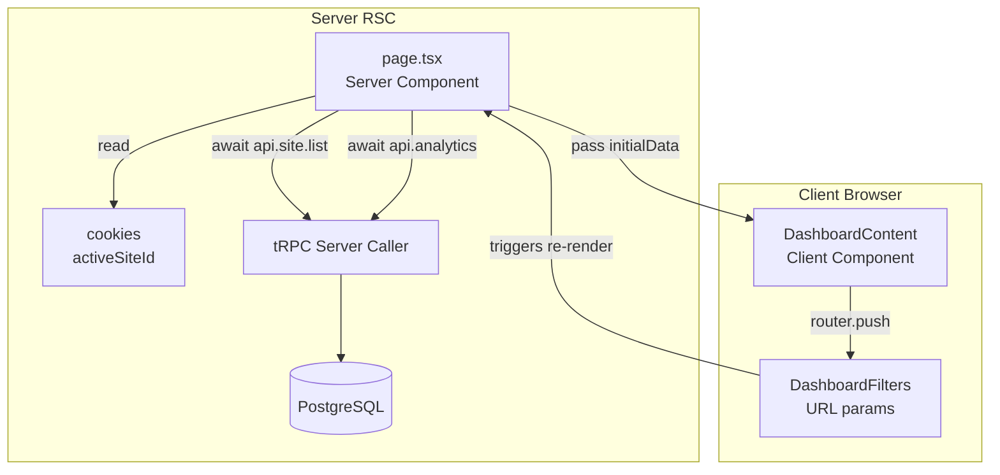
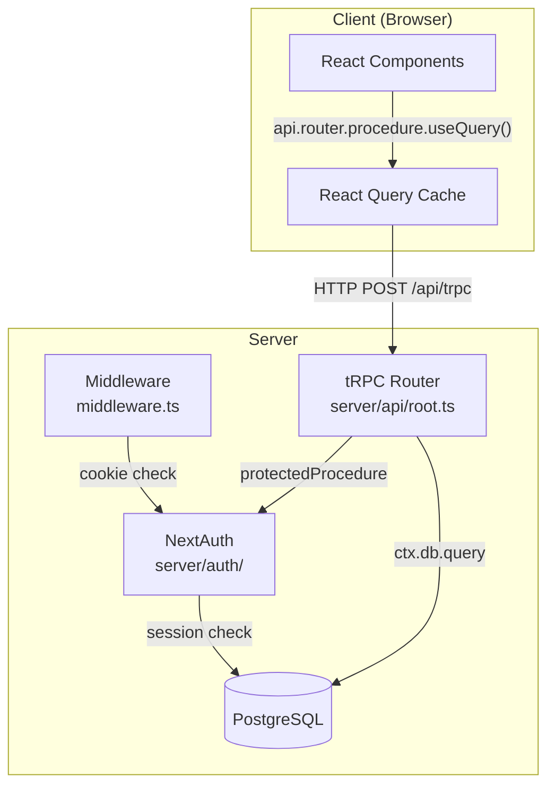
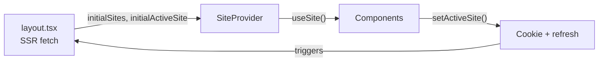
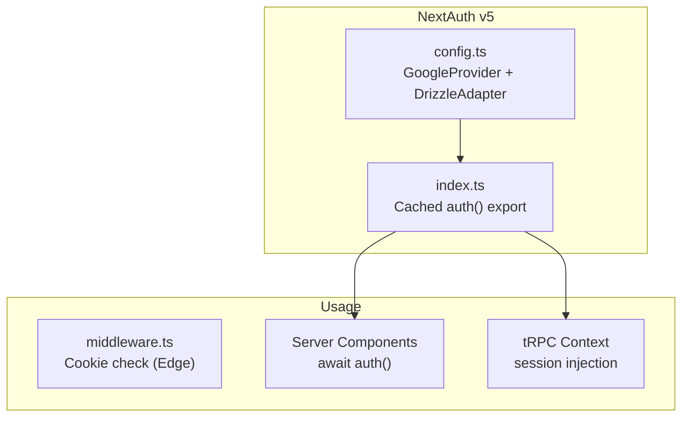

# Frontend Architecture

> AI Agent Quick Reference - PropIntel Web Application (`apps/web`)

## Quick Navigation

| Section                                   | Purpose                                      |
| ----------------------------------------- | -------------------------------------------- |
| [Tech Stack](#tech-stack)                 | Framework versions and config locations      |
| [Directory Map](#directory-map)           | File locations with purposes                 |
| [Data Flow](#data-flow)                   | How data moves through the app               |
| [Routing](#routing)                       | Page structure and auth gates                |
| [State Management](#state-management)     | Server state (tRPC) + Client state (Zustand) |
| [Component Patterns](#component-patterns) | UI composition rules                         |
| [Auth System](#auth-system)               | NextAuth v5 configuration                    |
| [tRPC Routers](#trpc-router-reference)    | Available API endpoints                      |
| [Common Tasks](#common-tasks)             | Step-by-step guides                          |

---

## Tech Stack

| Layer        | Technology           | Version  | Config Location                     |
| ------------ | -------------------- | -------- | ----------------------------------- |
| Framework    | Next.js (App Router) | 16.x     | `apps/web/next.config.ts`           |
| UI Library   | React                | 19.x     | -                                   |
| API Layer    | tRPC                 | 11.x     | `apps/web/src/server/api/`          |
| Server State | TanStack Query       | 5.x      | `apps/web/src/trpc/query-client.ts` |
| Client State | Zustand              | 5.x      | `apps/web/src/stores/`              |
| Auth         | NextAuth             | 5.0-beta | `apps/web/src/server/auth/`         |
| Styling      | Tailwind CSS         | 4.x      | `apps/web/src/styles/globals.css`   |
| Components   | shadcn/ui + Radix    | -        | `apps/web/src/components/ui/`       |
| ORM          | Drizzle              | 0.41.x   | `packages/database/`                |
| Types        | TypeScript           | 5.8.x    | `apps/web/tsconfig.json`            |

---

## Directory Map

```
apps/web/src/
├── app/                          # Next.js App Router
│   ├── layout.tsx               # Root layout (TRPCReactProvider, SiteProvider)
│   ├── page.tsx                 # Landing page (public)
│   ├── login/page.tsx           # Auth page (redirects if logged in)
│   ├── dashboard/               # Protected routes (all require auth)
│   │   ├── layout.tsx           # Dashboard shell (sidebar, SSR site fetching)
│   │   ├── page.tsx             # Main analytics dashboard (Server Component)
│   │   ├── agent-analysis/      # AI agent behavior analysis
│   │   ├── robots/              # Robots.txt viewer
│   │   └── url/[id]/            # Dynamic URL detail page
│   └── api/                     # API routes
│       ├── auth/[...nextauth]/  # NextAuth handlers
│       ├── trpc/[trpc]/         # tRPC HTTP handler
│       ├── pixel/[trackingId]/  # Pixel tracking endpoint
│       └── middleware-track/    # Middleware tracking endpoint
│
├── components/
│   ├── ui/                      # shadcn/ui primitives (DO NOT MODIFY)
│   ├── dashboard/               # Dashboard-specific components
│   │   ├── dashboard-content.tsx # Client component for dashboard interactivity
│   ├── landing/                 # Landing page sections
│   ├── layout/                  # Navigation, sidebar
│   ├── login/                   # Auth form components
│   ├── robots/                  # Robots.txt analysis
│   ├── sites/                   # Site switcher, management
│   └── ai-elements/             # AI visualization components
│
├── contexts/
│   └── site-context.tsx         # Active site selection (SSR props + cookie switching)
│
├── hooks/
│   ├── use-dashboard.ts         # Dashboard data aggregation
│   ├── use-dashboard-filters.ts # URL-based filter state (timeframe, source, companies)
│   ├── use-job.ts               # Single job status polling
│   ├── use-jobs.ts              # Job list with polling
│   └── use-mobile.ts            # Responsive breakpoint detection
│
├── lib/
│   ├── utils.ts                 # cn() helper for Tailwind class merging
│   ├── cookies.ts               # Client-side cookie utilities (site selection)
│   ├── crawler-detection.ts     # AI crawler user-agent patterns
│   └── api/                     # External API utilities
│
├── server/
│   ├── api/
│   │   ├── trpc.ts              # tRPC initialization, procedures
│   │   ├── root.ts              # Router aggregation (AppRouter)
│   │   └── routers/             # Feature routers (see tRPC section)
│   ├── auth/
│   │   ├── index.ts             # Cached auth() export
│   │   └── config.ts            # NextAuth config (Google OAuth)
│   ├── actions/                 # Server Actions
│   └── db/                      # Database connection
│
├── stores/
│   └── site-store.ts            # Zustand store (persisted site selection)
│
├── trpc/
│   ├── react.tsx                # Client tRPC provider + api export
│   ├── server.ts                # RSC tRPC caller
│   └── query-client.ts          # React Query config
│
├── styles/
│   └── globals.css              # Tailwind + theme variables
│
├── middleware.ts                # Auth route protection (Edge)
└── env.ts                       # Environment variable validation (Zod)
```

---

## Data Flow

### SSR Pattern (Dashboard)

The main dashboard uses Server-Side Rendering for faster initial load:



### Client-Side Pattern (Other Pages)



---

## Routing

### Route Protection Matrix

| Route Pattern           | Auth Required | Middleware Action                                        |
| ----------------------- | ------------- | -------------------------------------------------------- |
| `/`                     | No            | Pass through                                             |
| `/login`                | No            | Redirect to `/dashboard` if authenticated                |
| `/login?force=true`     | No            | Bypass redirect (force login page)                       |
| `/dashboard/**`         | Yes           | Redirect to `/login` if unauthenticated                  |
| `/dashboard/agent-analysis` | Yes | Main analysis view (Detailed Results) |
| `/dashboard/url/[id]`   | Yes | URL-specific history (Coming Soon) |
| `/api/trpc/**`          | Varies        | Per-procedure (`protectedProcedure` / `publicProcedure`) |
| `/api/pixel/**`         | No            | Public tracking endpoint                                 |
| `/api/middleware-track` | No            | Public tracking endpoint                                 |

### Middleware Implementation

File: `apps/web/src/middleware.ts`

```typescript
// Cookie-based session detection (Edge runtime compatible)
const sessionToken =
  request.cookies.get("authjs.session-token")?.value ??
  request.cookies.get("__Secure-authjs.session-token")?.value ??
  request.cookies.get("next-auth.session-token")?.value;
```

Matcher: `["/login", "/dashboard/:path*"]`

---

## State Management

### Server State (tRPC + React Query)

**SSR Pattern (Dashboard):**

```typescript
// apps/web/src/app/dashboard/page.tsx (Server Component)
import { cookies } from "next/headers";
import { api } from "@/trpc/server";

export default async function DashboardPage({ searchParams }) {
  const params = await searchParams;
  const cookieStore = await cookies();
  const siteId = cookieStore.get("activeSiteId")?.value;

  // Fetch all data in parallel on server
  const [sites, summary, crawlerStats] = await Promise.all([
    api.site.list(),
    api.analytics.getSummary({ siteId, ...params }),
    api.analytics.getCrawlerStats({ siteId, ...params }),
  ]);

  return <DashboardContent initialData={{ summary, crawlerStats }} />;
}
```

**Client Component Pattern:**

```typescript
// For pages that need client-side interactivity
"use client";
import { api } from "@/trpc/react";

const { data, isLoading } = api.analytics.getSummary.useQuery(
  { siteId: activeSite?.id ?? "" },
  { enabled: !!activeSite?.id },
);

// Mutations
const mutation = api.site.create.useMutation({
  onSuccess: () => utils.site.list.invalidate(),
});
```

### Client State (Zustand)

File: `apps/web/src/stores/site-store.ts`

```typescript
import { create } from "zustand";
import { persist } from "zustand/middleware";

interface SiteStore {
  activeSiteId: string | null;
  setActiveSiteId: (id: string | null) => void;
}

export const useSiteStore = create<SiteStore>()(
  persist(
    (set) => ({
      activeSiteId: null,
      setActiveSiteId: (id) => set({ activeSiteId: id }),
    }),
    { name: "site-store" }, // localStorage key
  ),
);
```

### Site Context (SSR + Cookie Pattern)

File: `apps/web/src/contexts/site-context.tsx`

Site selection uses SSR with cookie persistence:

- **Server**: Layout fetches sites and reads `activeSiteId` cookie
- **Props**: `SiteProvider` receives `initialSites` and `initialActiveSite`
- **Switching**: `setActiveSite()` sets cookie + calls `router.refresh()`



**Usage:**

```typescript
import { useSite } from "@/contexts/site-context";

function MyComponent() {
  const { activeSite, setActiveSite, sites, isLoading } = useSite();
  // isLoading is always false (data pre-fetched on server)
}
```

**Cookie Utility** (`lib/cookies.ts`):

```typescript
import { setActiveSiteCookie } from "@/lib/cookies";

// Client-side only - sets "activeSiteId" cookie
setActiveSiteCookie(site.id);
```

---

## Component Patterns

### shadcn/ui Structure

Location: `apps/web/src/components/ui/`

**Pattern:** Radix primitive + cva variants + cn() merge

```typescript
import { cva, type VariantProps } from "class-variance-authority";
import { cn } from "@/lib/utils";

const buttonVariants = cva("base-classes", {
  variants: { variant: { default: "...", destructive: "..." } },
  defaultVariants: { variant: "default" },
});

function Button({ className, variant, ...props }) {
  return <button className={cn(buttonVariants({ variant, className }))} {...props} />;
}
```

### Feature Component Organization

```
components/
├── ui/           # Primitives - DO NOT MODIFY (managed by shadcn CLI)
├── layout/       # App shell (Sidebar, Nav) - shared across dashboard
├── dashboard/    # Dashboard-specific (Charts, Tables, Cards)
└── [feature]/    # Feature-specific components
```

---

## Auth System



### Key Files

| File                                  | Purpose                                             |
| ------------------------------------- | --------------------------------------------------- |
| `server/auth/config.ts`               | Provider config (Google), DrizzleAdapter, callbacks |
| `server/auth/index.ts`                | Cached `auth()`, `signIn()`, `signOut()` exports    |
| `app/api/auth/[...nextauth]/route.ts` | HTTP handlers (GET/POST)                            |
| `middleware.ts`                       | Route protection (cookie-based, Edge compatible)    |

### Session Access

```typescript
// Server Component or tRPC router
import { auth } from "@/server/auth";

const session = await auth();
// session?.user.id - available in protectedProcedure
```

---

## tRPC Router Reference

File: `apps/web/src/server/api/root.ts`

| Router         | File                      | Key Procedures                                                     |
| -------------- | ------------------------- | ------------------------------------------------------------------ |
| `site`         | `routers/site.ts`         | `list`, `getById`, `create`, `update`, `delete`                    |
| `analytics`    | `routers/analytics.ts`    | `getSummary`, `getCrawlerStats`, `getVisitTimeline`, `getTopPages` |
| `tracking`     | `routers/tracking.ts`     | Snippet generation (pixel/middleware)                              |
| `robots`       | `routers/robots.ts`       | Robots.txt parsing and analysis                                    |
| `job`          | `routers/job.ts`          | `getById`, `getStatus`                                             |
| `orchestrator` | `routers/orchestrator.ts` | Job orchestration                                                  |
| `url`          | `routers/url.ts`          | URL CRUD operations                                                |
| `dashboard`    | `routers/dashboard.ts`    | Dashboard aggregations                                             |
| `post`         | `routers/post.ts`         | Example/placeholder router                                         |

### Procedure Types

```typescript
// apps/web/src/server/api/trpc.ts
export const publicProcedure = t.procedure; // No auth required
export const protectedProcedure = t.procedure.use(({ ctx, next }) => {
  if (!ctx.session?.user) throw new TRPCError({ code: "UNAUTHORIZED" });
  return next({ ctx: { session: ctx.session } });
});
```

---

## Common Tasks

### Add a New tRPC Endpoint

1. Create/modify router in `apps/web/src/server/api/routers/[name].ts`
2. Use `protectedProcedure` for auth-required endpoints
3. Define input schema with Zod
4. Register router in `apps/web/src/server/api/root.ts`
5. Call via `api.[router].[procedure].useQuery()` or `.useMutation()`

### Add a New Dashboard Page

**Option A: SSR (recommended for data-heavy pages)**

1. Create `apps/web/src/app/dashboard/[feature]/page.tsx` as Server Component
2. Read `activeSiteId` from cookies: `const cookieStore = await cookies()`
3. Fetch data via `api.[router].[procedure]()` (server tRPC caller)
4. Pass data to a Client Component for interactivity

**Option B: Client-side (for interactive pages)**

1. Create `apps/web/src/app/dashboard/[feature]/page.tsx`
2. Add `"use client"` directive
3. Use `useSite()` for active site context
4. Fetch data via `api.[router].[procedure].useQuery()`

### Add a New UI Component

1. For shadcn primitives: `npx shadcn@latest add [component]`
2. For feature components: Create in `components/[feature]/[name].tsx`
3. Use `cn()` from `@/lib/utils` for className merging

### Add a New Zustand Store

1. Create `apps/web/src/stores/[name]-store.ts`
2. Use `persist()` middleware for localStorage persistence
3. Export typed hook: `export const use[Name]Store = create<[Type]>()(...)`

---

## Import Aliases

| Alias                 | Resolves To         |
| --------------------- | ------------------- |
| `@/*`                 | `apps/web/src/*`    |
| `@propintel/database` | `packages/database` |
| `@propintel/types`    | `packages/types`    |

---

## Environment Variables

File: `apps/web/src/env.ts` (Zod validated)

**Server-only:**

- `AUTH_SECRET` - NextAuth secret
- `AUTH_GOOGLE_ID` - Google OAuth client ID
- `AUTH_GOOGLE_SECRET` - Google OAuth secret
- `DATABASE_URL` - PostgreSQL connection string

**Client-exposed:**

- `NEXT_PUBLIC_APP_URL` - Application URL
