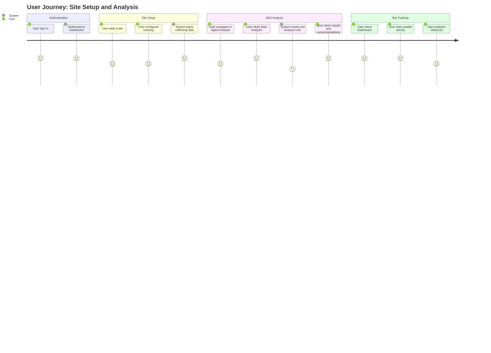

# User Flow Documentation

## Primary Workflows

BrandSight provides two core value propositions:
1. **Bot Traffic Analytics** - Track how AI crawlers are accessing your site
2. **AEO Analysis** - Analyze and improve your visibility in AI answer engines

## Detailed Steps

### 1. Authentication
- User accesses the application.
- Authenticates via NextAuth (Email/Password or Social Provider).
- Upon success, lands on `/dashboard`.

### 2. Dashboard - Bot Traffic Analytics (`/dashboard`)
The main dashboard focuses on tracking AI bot traffic to your site:

- **Summary Cards**: Total visits, unique URLs crawled, unique crawlers, visits today
- **Crawler Chart**: Breakdown of which AI bots are visiting (GPTBot, ClaudeBot, etc.)
- **Timeline**: Activity over time (hourly/daily aggregation)
- **Top Pages**: Most frequently crawled pages with trend data
- **Tracking Status**: Shows if pixel/middleware tracking is configured

**Filters Available**:
- Time frame: 12h, 24h, 3d, 7d, 30d, 90d
- Source: pixel or middleware
- Companies: Filter by specific AI companies

### 3. Site Management
- Users can manage multiple sites
- Each site has a unique tracking ID
- Active site can be switched via the sidebar
- Site context is preserved via cookies

### 4. Robots Analysis (`/dashboard/robots`)
Analyze how your site communicates with AI crawlers:

- **Permission Matrix**: Visual overview of what each AI bot is allowed to access
- **robots.txt Viewer**: View and analyze your robots.txt rules
- **llms.txt Viewer**: View and analyze your llms.txt file (if present)

### 5. AEO Analysis (`/dashboard/agent-analysis`)

#### Starting an Analysis
- User selects a site (required)
- User clicks "Start New Analysis"
- System validates the URL and rate limits
- System queues the job for processing

#### Job Processing States
Jobs move through the following statuses:
1. **Pending**: Job created, waiting to be queued
2. **Queued**: Job sent to SQS, waiting for worker
3. **Crawling**: Fetching pages (HTTP-based, with optional ECS/SPA rendering)
4. **Analyzing**: Multi-agent pipeline is executing
5. **Completed**: Report is ready
6. **Failed**: Processing error occurred
7. **Blocked**: Site blocked access (CAPTCHA, 403, etc.)

#### Pipeline Visualization
The analysis page shows real-time progress through 4 phases:
- **Discovery**: Page analysis, query generation, competitor discovery
- **Research**: Tavily search, Perplexity citations, community signals, LLM brand probe
- **Analysis**: Citation analysis, content comparison, visibility scoring
- **Output**: Recommendations, cursor prompt, report generation

#### Viewing Results (Tabs)
1. **Pipeline Tab**: Real-time progress visualization with agent status
2. **Results Tab**:
   - Score Dashboard (AEO, SEO, LLMEO scores)
   - Key Findings (strengths, weaknesses, opportunities)
   - Citation Chart (visibility across queries)
   - Competitor Landscape (how you compare)
3. **Recommendations Tab**:
   - Prioritized action items (High/Medium/Low impact)
   - Cursor Prompt (copy-paste code for AI-assisted fixes)
   - Community Engagement Opportunities (Reddit, X, etc.)
4. **Details Tab**:
   - Page Analysis breakdown
   - Query Performance metrics
   - Content Gaps analysis
   - Full JSON report (for debugging)

### 6. Export Options
- Download report in **Markdown** format
- Download report in **JSON** format
- Copy "Cursor Prompts" for AI-assisted implementation
- Webhook delivery (if configured)

## Key Entities

| Entity | Description |
|--------|-------------|
| **User** | Authenticated user account |
| **Site** | A website domain being tracked/analyzed |
| **Job** | A single analysis run for a site |
| **Analysis** | Summary of analysis results (stored in DB for fast queries) |
| **Report** | Full analysis report (stored in S3) |
