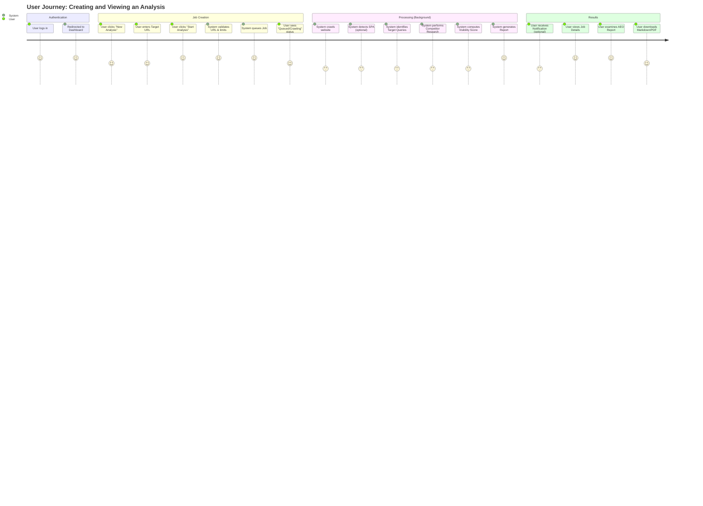

# User Flow Documentation

## Primary Workflow: AEO Analysis

The core value of PropIntel is providing actionable AEO (Answer Engine Optimization) analysis.

## Detailed Steps

### 1. Authentication
- User accesses the application.
- Authenticates via NextAuth (Email/Password or Social Provider).
- Upon success, lands on `/dashboard`.

### 2. Dashboard & Job Management (`/dashboard`)
- Displays list of recent jobs with statuses (`Completed`, `Crawling`, `Failed`).
- Shows key metrics (e.g., Credits remaining, Total analyses).

### 3. Creating a Job
- **Input**: User provides valid URL (e.g., `https://example.com`).
- **Options**:
    - Select Region (US, UK, etc. - *if implemented*).
    - Select Mode (Fast/Deep).
- **Validation**: Backend checks rate limits and URL validity.
- **Feedback**: Immediate confirmation that job is queued.

### 4. Analysis Pipeline (System)
- The job moves through several states visible to the user:
    1.  **Queued**: Waiting for worker availability.
    2.  **Crawling**: Fetching pages (Simple or ECS/SPA).
    3.  **Analyzing**: The multi-agent system executes in phases:
        - *Discovery*: Identifying what the page is about.
        - *Research*: Searching the web for validation.
        - *Analysis*: Computing scores and checking competitors.
    4.  **Completed**: Report is ready.

### 5. Viewing Results (`/dashboard/jobs/[id]`)
- **Overview**: High-level scores (AEO Visibility Score, SEO Score).
- **Key Findings**: Top 3-5 critical insights.
- **Recommendations**: Actionable steps to improve visibility.
- **Detailed Data**:
    - **Target Queries**: What users are asking.
    - **Competitors**: Who is ranking above the target.
    - **Citations**: Where the brand is mentioned.

### 6. Export
- User can download the report in **Markdown** format for easy sharing or editing.
- User can copy "Cursor Prompts" to help fix issues using AI code editors.
