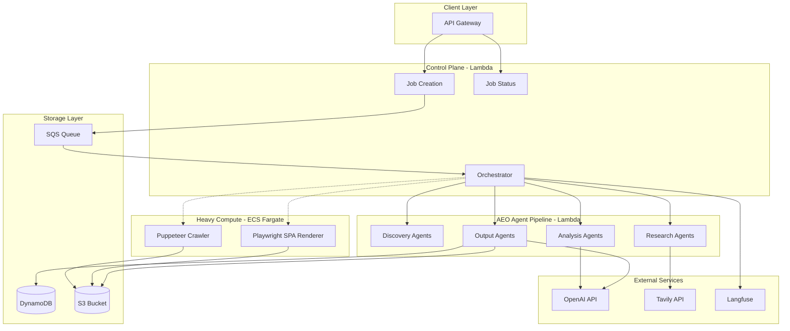

# PropIntel AEO Analyzer - Consolidated Roadmap

## What's Already Built (Phase 1 Complete)

| Component | Status | Location |

|-----------|--------|----------|

| VPC, S3, DynamoDB, SQS infrastructure | DONE | `serverless.yml` |

| Lambda control plane (job create, status, health) | DONE | `src/handlers/job.ts`, `health.ts` |

| Multi-tenant DynamoDB schema | DONE | `src/lib/dynamodb.ts` |

| Basic HTTP crawler (Lambda-based) | DONE | `src/lib/crawler-simple.ts` |

| LLMEO/SEO analysis modules | DONE | `src/analysis/llmeo.ts`, `seo.ts` |

| JSON + Markdown report generation | DONE | `src/lib/s3.ts` |

| Vercel AI SDK integration | DONE | `src/lib/ai.ts` |

| Langfuse observability | DONE | `src/lib/ai.ts` |

| ECS Fargate cluster (idle, ready for use) | DONE | `serverless.yml` |

## Architecture Overview



## Consolidated Milestones

### Milestone 1: AEO Agent Pipeline

**Goal**: Add AI visibility analysis to every crawl job

| Phase | Description | Effort |

|-------|-------------|--------|

| 1.1 | AEO types + Tavily client setup | Small |

| 1.2 | Discovery agents (page-analysis, query-gen, competitor-discovery) | Medium |

| 1.3 | Research agent (Tavily-based citation search) | Medium |

| 1.4 | Analysis agents (citation, content-comparison, visibility-scoring) | Medium |

| 1.5 | Output agents (recommendation, cursor-prompt, report-generator) | Medium |

| 1.6 | Update orchestrator to run 4-phase AEO pipeline | Small |

**New Files:**

```
src/agents/
  discovery/
    page-analysis.ts       # Extract topic, entities, intent from HTML
    query-generation.ts    # LLM generates 10-20 target queries
    competitor-discovery.ts # Find competing domains via Tavily
  research/
    tavily-research.ts     # Search each query, extract citations
  analysis/
    citation-analysis.ts   # Calculate who gets cited, frequency
    content-comparison.ts  # Compare your content vs winners
    visibility-scoring.ts  # Calculate AEO visibility score 0-100
  output/
    recommendation.ts      # Prioritized, actionable fixes
    cursor-prompt.ts       # Ready-to-paste Cursor prompt
    report-generator.ts    # Merge AEO + existing LLMEO/SEO report
src/lib/
  tavily.ts               # Tavily API client wrapper
```

**Modified Files:**

- `src/types/index.ts` - Add AEO types
- `src/handlers/orchestrator.ts` - Add 4-phase AEO pipeline
- `serverless.yml` - Add TAVILY_API_KEY, increase timeout to 15 min

---

### Milestone 2: SPA Rendering via ECS Fargate

**Goal**: Full JavaScript rendering for SPA/React sites using existing ECS infrastructure

| Phase | Description | Effort |

|-------|-------------|--------|

| 2.1 | Playwright Docker container | Medium |

| 2.2 | ECS task definition + orchestrator integration | Medium |

| 2.3 | SPA detection (trigger ECS when minimal initial HTML) | Small |

| 2.4 | Rendered snapshot storage in S3 | Small |

**New Files:**

```
infrastructure/ecs/
  Dockerfile.render      # Playwright + Chromium container
src/lib/
  renderer.ts            # ECS task launcher + result handler
  spa-detector.ts        # Detect if site needs JS rendering
```

---

### Milestone 3: Diff Reports + Reproducibility

**Goal**: Track content changes over time, score stability

| Phase | Description | Effort |

|-------|-------------|--------|

| 3.1 | Store previous crawl snapshots | Small |

| 3.2 | Diff report generation (HTML/content diff) | Medium |

| 3.3 | Reproducibility scoring | Small |

| 3.4 | Historical trend API endpoint | Small |

**New Files:**

```
src/reports/
  diff-generator.ts       # Compare current vs previous crawl
  reproducibility.ts      # Score content stability over time
```

---

### Milestone 4: Advanced Heuristics + Templates

**Goal**: Smarter, template-aware analysis

| Phase | Description | Effort |

|-------|-------------|--------|

| 4.1 | Template detection (blog, product, landing, docs) | Medium |

| 4.2 | Per-template scoring rules | Medium |

| 4.3 | Industry benchmarks integration | Medium |

**New Files:**

```
src/analysis/
  template-detector.ts    # Classify page types
  template-rules.ts       # Template-specific scoring
  benchmarks.ts           # Industry-specific benchmarks
```

---

### Milestone 5: Community Signals

**Goal**: Track brand mentions across social/dev platforms

| Phase | Description | Effort |

|-------|-------------|--------|

| 5.1 | Community search via Tavily (Reddit, HN, GitHub, Twitter) | Medium |

| 5.2 | Engagement scoring (normalize across platforms) | Small |

| 5.3 | Training data signals (flag LLM training influence) | Small |

**Enhancements to:** `src/agents/research/tavily-research.ts`

---

### Milestone 6: Competitor Deep Dive

**Goal**: Full competitor crawl and gap analysis

| Phase | Description | Effort |

|-------|-------------|--------|

| 6.1 | Parallel competitor job queuing | Medium |

| 6.2 | Side-by-side comparison report | Medium |

| 6.3 | LLM-generated gap analysis narrative | Small |

| 6.4 | Priority action generation | Small |

**New Files:**

```
src/analysis/
  competitor-comparison.ts  # Side-by-side scoring
  gap-analysis.ts           # Identify gaps and opportunities
src/reports/
  competitive-report.ts     # Generate comparison report
```

---

### Milestone 7: Dashboard + Monitoring

**Goal**: Real-time monitoring, scheduled crawls, alerts

| Phase | Description | Effort |

|-------|-------------|--------|

| 7.1 | Dashboard API endpoints (metrics, trends) | Medium |

| 7.2 | Scheduled crawls (EventBridge cron) | Medium |

| 7.3 | Enhanced webhooks (Slack, Discord payloads) | Small |

| 7.4 | Alert rules (score drops, new competitors) | Small |

**New Endpoints:**

```
GET  /dashboard/summary      # Aggregate metrics
GET  /dashboard/trends       # Score trends over time
POST /schedules              # Create scheduled crawl
GET  /alerts                 # List active alerts
```

---

## Milestone Priority Order

| Priority | Milestone | Focus |

|----------|-----------|-------|

| 1 | AEO Agent Pipeline | Core new functionality |

| 2 | SPA Rendering | Better crawling for JS sites |

| 3 | Diff Reports | Track changes over time |

| 4 | Templates + Heuristics | Smarter analysis |

| 5 | Community Signals | Social presence tracking |

| 6 | Competitor Deep Dive | Full competitive analysis |

| 7 | Dashboard + Monitoring | Operations and alerts |

## Technology Stack

| Layer | Technology |

|-------|------------|

| API | API Gateway HTTP API |

| Control Plane | Lambda (Node.js 20) |

| Agent Pipeline | Lambda modules |

| Heavy Compute | ECS Fargate (Milestone 2+) |

| Database | DynamoDB |

| Storage | S3 |

| Queue | SQS with DLQ |

| AI/LLM | OpenAI via Vercel AI SDK |

| Search | Tavily API |

| Observability | Langfuse |

## Key Decisions

| Decision | Choice |

|----------|--------|

| Primary Metric | AEO Visibility Score (LLMEO/SEO become secondary) |

| Queries per URL | 10 queries (balanced cost/comprehensiveness) |

| Tavily API | Key available, ready to use |

## Risks and Mitigations

| Risk | Mitigation |

|------|------------|

| Tavily API costs | Budget monitoring, response caching |

| Lambda timeout | Increase to 15 min, split phases via SQS if needed |

| ECS cold start | Use warm pool for frequent usage |

| LLM token costs | Use gpt-4o-mini, cache responses |

| S3 storage growth | 30-day lifecycle rules (already configured) |