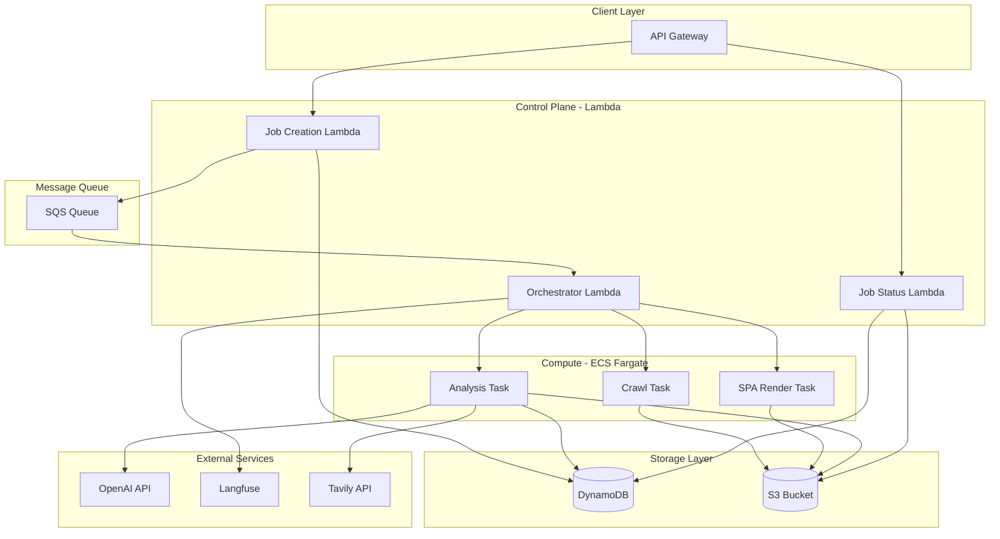

# LLMEO/SEO Crawler API - Full Implementation Plan

## Architecture Overview



## Project Structure (Fresh Start)

```
src/
  handlers/           # Lambda handlers
    job.ts           # Job create/status endpoints
    orchestrator.ts  # SQS consumer, task coordination
  tasks/              # ECS Fargate task entry points
    crawl.ts         # Static site crawler
    render.ts        # SPA renderer (Playwright)
    analyze.ts       # Analysis runner
  analysis/           # Analysis modules
    llmeo.ts         # LLMEO scoring and checks
    seo.ts           # SEO analysis
    competitor.ts    # Competitor comparison
    community.ts     # Tavily community signals
  lib/
    dynamodb.ts      # DynamoDB client + tenant isolation
    s3.ts            # S3 operations
    sqs.ts           # Queue operations
    ai.ts            # Vercel AI SDK wrapper
    langfuse.ts      # Langfuse tracing
    tavily.ts        # Tavily client
    crawler.ts       # Puppeteer/Playwright crawler
  reports/
    generator.ts     # JSON + Markdown report builder
    schemas.ts       # Report JSON schemas
  types/
    index.ts         # TypeScript types
infrastructure/
  serverless.yml     # Main Serverless config
  ecs/
    task-definitions/ # ECS task definitions
    Dockerfile.crawl  # Crawler container
    Dockerfile.render # SPA renderer container
```

## Implementation Phases

### Phase 1: Core Infrastructure + Quick Scan

- Set up Serverless Framework with VPC, S3, DynamoDB, SQS
- Lambda control plane (job create, status, orchestrator)
- Basic ECS Fargate task for static crawling (no SPA)
- Core LLMEO/SEO analysis modules
- JSON + Markdown report output
- Multi-tenant DynamoDB schema with tenant isolation

### Phase 2: SPA Rendering + Diff Reports

- Playwright container for SPA rendering
- Reproducibility scoring
- Diff report generation (track changes over time)
- Artifact storage in S3 with lifecycle rules

### Phase 3: Advanced Heuristics + Per-Template Recommendations

- Enhanced scoring algorithms
- Template detection and per-template suggestions
- Dashboard data endpoints

### Phase 4: Tavily Integration

- Community signals enrichment (Reddit, social media, dev forums)
- Cross-industry normalized engagement scores
- Citation tracking

### Phase 5: LLM Summaries via Vercel AI SDK

- Structured summaries (Strengths, Weaknesses, Opportunities, Next Steps)
- Copy-ready prompts with per-tenant versioning
- Schema block generation (JSON-LD, TL;DR)

### Phase 6: Langfuse Observability

- Full tracing for all agent workflows
- Per-page and per-job metadata events
- Tenant-segmented dashboards

### Phase 7: Competitor Comparison Module

- Auto-suggest competitors based on keyword overlap
- Side-by-side scoring
- Competitive gap analysis narrative
- Priority action generation

## Key Technical Decisions

| Concern | Decision |

|---------|----------|

| Service Name | propintel |

| AWS Region | us-west-2 |

| AWS Profile | default4 |

| Database | DynamoDB only with GSIs for tenant queries |

| Authentication | API Key per tenant |

| Crawling | Puppeteer for static, Playwright for SPA |

| Default Limits | 50 pages max, 3 levels deep (configurable) |

| Concurrent Jobs | 1 per tenant |

| Error Handling | Continue on failure, skip pages, report in warnings |

| IaC | Serverless Framework with ECS plugin |

| LLM | Vercel AI SDK with OpenAI (model configurable per request) |

| Tracing | Langfuse for all LLM calls |

| Multi-tenancy | Full isolation with tenant ID prefix on DynamoDB keys |

| Secrets | .env file locally + Lambda environment variables |

| Local Dev | serverless-offline |

| Report Retention | 30 days (S3 lifecycle rules) |

| Notifications | Polling + Webhook callbacks |

| Cost Control | On-demand ECS tasks, S3 lifecycle rules, tiered scan pricing |

| robots.txt | Strict compliance |

| Content Types | Everything including images (for alt-text analysis) |

| Auth Pages | Support basic auth and cookie-based sessions |

| Score Weights | LLMEO-heavy (70/30) |

| Competitor Discovery | Both manual and auto-suggest |

| Webhook Payload | Full report embedded |

| User-Agent | Mimic Chrome browser |

| IP Rotation | No (single IP with respectful rate limits) |

| Crawl Delay | Adaptive based on robots.txt crawl-delay |

| Testing | None for now |

| Deploy Stages | dev only |

| API Key Management | Seed from config file |

| Large Sites | Warn and continue to exact limit, then stop |

| Redirect Handling | Log redirects, treat as separate URLs |

| Page Timeout | 30 seconds |

| JS Rendering Phase 1 | Puppeteer renders JS |

| Duplicate Content | Skip exact duplicates |

| Report Language | Auto-detect from crawled site |

| CloudWatch Logs | Standard (warnings and key events) |

| Cost Tracking | Detailed (compute, storage, API calls per tenant) |

| Schema Analysis | All Schema.org types found |

| Freshness Threshold | 30 days before flagging stale |

| Min Word Count | 100 words for substantive content |

| URL Exclusions | Standard (admin, login, cart, checkout, search) |

| Broken Link Check | No (faster crawls) |

| Max Job Duration | 15 minutes |

| Viewport | Desktop only (1920x1080) |

| noindex Pages | Crawl but flag in report |

| Canonical URLs | Follow canonical only |

| Sitemap Priority | Yes, high priority pages first |

| hreflang | Flag alternate versions, do not crawl |

| Rate Limit 429 | Stop crawl, report partial results |

| Server Errors 5xx | No retry, log and skip |

| SSL Validation | Strict, fail on invalid certs |

| OpenAI Temperature | 0 (deterministic) |

| Auto-suggest Competitors | 3 by default |

| Report Format | JSON and Markdown equally important |

| Max File Size | 5 MB for PDFs and images |

| CAPTCHA Handling | Stop crawl, report as blocked |

| Empty Pages | Include with low content warning |

## DynamoDB Schema

```
PK: TENANT#<tenantId>
SK: JOB#<jobId>              -> Job metadata
SK: PAGE#<jobId>#<pageUrl>   -> Per-page results
SK: REPORT#<jobId>           -> Final report reference
SK: PROMPT#<version>         -> Per-tenant prompt versions

GSI1:
PK: JOB#<jobId>              -> Cross-tenant job lookup (admin)
SK: <timestamp>
```

## API Endpoints

| Method | Path | Description |

|--------|------|-------------|

| POST | /jobs | Create crawl job |

| GET | /jobs/{id} | Get job status |

| GET | /jobs/{id}/report | Get final report |

| GET | /jobs | List jobs (tenant-scoped) |

| POST | /jobs/{id}/compare | Add competitor comparison |

## Estimated Deliverables

Phase 1-2 establishes the core crawling pipeline. Phases 3-7 add intelligence and polish. Each phase builds on the previous, allowing for iterative deployment and testing.